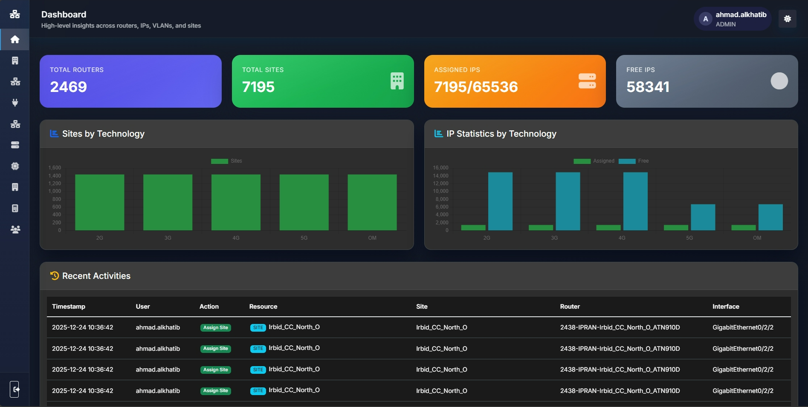
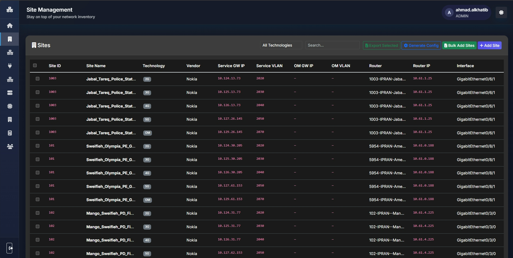
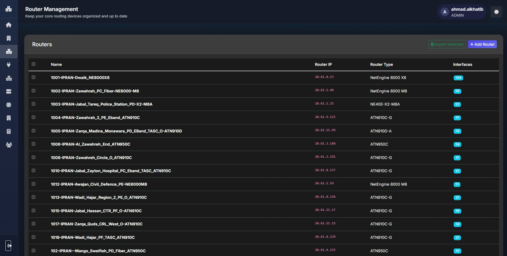
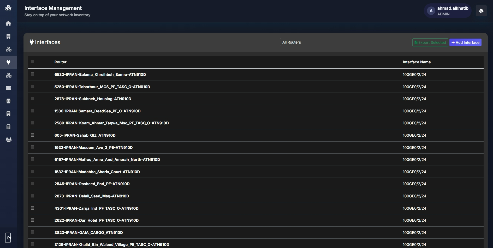
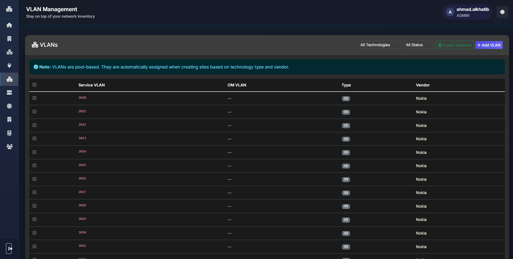
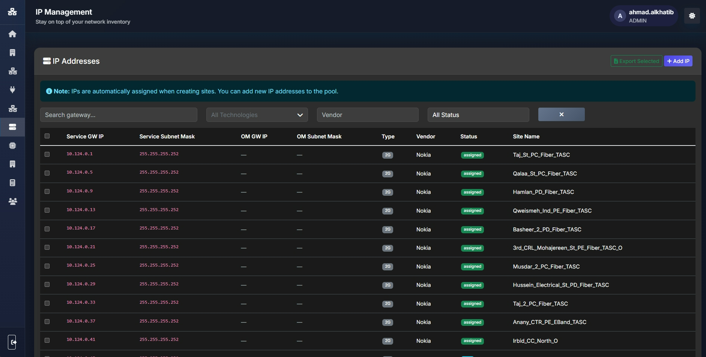
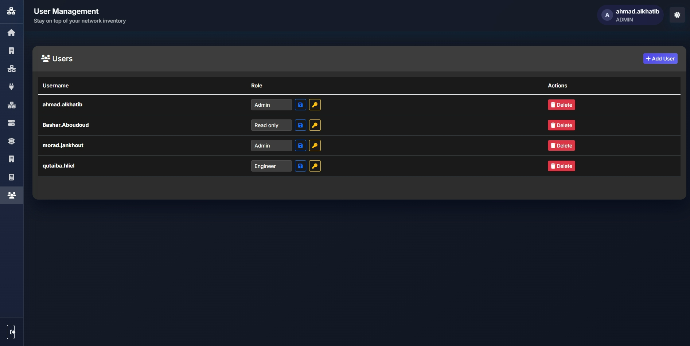

# IP-VLAN Manager

A comprehensive web-based network management system for managing IP addresses, VLANs, routers, interfaces, sites, vendors, and technologies. Built with Flask and featuring a modern, responsive UI with role-based access control.

## 📋 Table of Contents

- [Features](#features)
- [Screenshots](#screenshots)
- [Prerequisites](#prerequisites)
- [Installation](#installation)
- [Configuration](#configuration)
- [Usage](#usage)
- [Project Structure](#project-structure)
- [API Endpoints](#api-endpoints)
- [User Roles](#user-roles)
- [Services](#services)
- [Contributing](#contributing)
- [License](#license)

## ✨ Features

### Core Functionality
- **IP Address Management**: Track and manage IP addresses with status (free/assigned), vendor associations, and detailed information
- **VLAN Management**: Comprehensive VLAN tracking with site associations and status monitoring
- **Router Management**: Manage routers with vendor information, hostnames, and associations
- **Interface Management**: Track router interfaces with IP and VLAN assignments
- **Site Management**: Manage network sites with bulk import/export capabilities
- **Vendor Management**: Organize equipment by vendor
- **Technology Management**: Track network technologies

### Advanced Features
- **Subnet Calculator**: Built-in subnet calculator for network planning
- **Bulk Operations**: Import/export sites via Excel templates
- **Activity Logging**: Comprehensive audit trail of all user actions
- **Search & Filter**: Advanced search and filtering across all entities
- **Role-Based Access Control**: Admin, Engineer, and Read-only user roles
- **Password Management**: Secure password handling with forced password changes
- **FTP Services**: Automated services for updating routers and sites from external sources
- **Dashboard Statistics**: Real-time statistics and insights

### User Interface
- Modern, responsive design with dark/light theme support
- Glass-morphism UI elements
- Mobile-friendly interface
- Real-time updates and notifications

## 📸 Screenshots

### Dashboard

*Main dashboard showing statistics for routers, sites, IPs, and VLANs*

### Site Management

*Site management with bulk import/export functionality*

### Router Management

*Router management interface showing router details and associations*

### Interface Management

*Interface management interface showing router interfaces details and associations*

### VLAN Management

*VLAN management with site associations and status tracking*

### IP Management

*IP address management interface with search and filtering capabilities*

### User Management

*User management interface with role assignment*

## 🔧 Prerequisites

- Python 3.8 or higher
- pip (Python package manager)
- MySQL (optional, SQLite is used by default)

## 📦 Installation

1. **Clone the repository** (or navigate to the project directory):
```bash
cd "IP-VLAN Manager"
```

2. **Install dependencies**:
```bash
pip install -r requirements.txt
```


3. **Initialize the database**:
The database will be automatically initialized when you first run the application. A default admin user will be created:
- Username: `admin`
- Password: `admin`
- **Note**: You will be required to change the password on first login.

## ⚙️ Configuration

Edit `config.py` to customize the application settings:

```python
class Config:
    HOST = 'localhost'  # Server host
    PORT = 5000          # Server port
    DEBUG = False        # Debug mode
    SECRET_KEY = 'your-secret-key-here'  # Change in production!
    SQLALCHEMY_DATABASE_URI = 'sqlite:///ip_vlan_manager.db'  # Database URI
```

### Environment Variables

You can also configure the application using environment variables:
- `HOST`: Server host (default: `localhost`)
- `PORT`: Server port (default: `5000`)
- `DEBUG`: Debug mode (default: `False`)
- `SECRET_KEY`: Secret key for sessions
- `DATABASE_URL`: Database connection string

## 🚀 Usage

### Running the Application

**Development Mode**:
```bash
python app.py
```

The application will be available at `http://localhost:5000`

**Production Mode**:
The application uses Waitress WSGI server for production. Set `DEBUG = False` in `config.py` and run:
```bash
python app.py
```

### Running Services

The application includes background services for updating routers and sites:

**Update Routers Service**:
```bash
cd fetching_services
python update_routers.py
```

**Update Sites Service**:
```bash
cd fetching_services
python update_sites.py
```

Or use the batch files:
```bash
fetching_services\run_service.bat
```

## 📁 Project Structure

```
IP-VLAN Manager/
├── app.py                      # Main Flask application
├── config.py                   # Configuration settings
├── requirements.txt            # Python dependencies
├── models/
│   └── models.py              # Database models
├── templates/                  # HTML templates
│   ├── base.html
│   ├── dashboard.html
│   ├── login.html
│   ├── routers.html
│   ├── ips.html
│   ├── vlans.html
│   ├── sites.html
│   ├── interfaces.html
│   ├── users.html
│   ├── vendors.html
│   ├── technologies.html
│   └── subnet_calculator.html
├── static/
│   ├── css/
│   │   └── style.css          # Main stylesheet
│   └── js/                    # JavaScript files
│       ├── app.js
│       ├── routers.js
│       ├── ips.js
│       ├── vlans.js
│       ├── sites.js
│       ├── interfaces.js
│       ├── users.js
│       ├── vendors.js
│       ├── technologies.js
│       └── subnet_calculator.js
├── fetching_services/          # Background services
│   ├── update_routers.py
│   ├── update_sites.py
│   ├── ftp_client.py
│   └── download_files.py
├── helping_scripts/            # Utility scripts
│   └── sites_ips_check.py
├── screenshots/                # Application screenshots
└── instance/                   # Database instance (created at runtime)
    └── ip_vlan_manager.db
```

## 🔌 API Endpoints

### Authentication
- `GET /login` - Login page
- `POST /login` - Authenticate user
- `GET /logout` - Logout user
- `GET /change-password` - Change password page
- `POST /change-password` - Update password

### Dashboard
- `GET /` - Redirect to dashboard
- `GET /dashboard` - Main dashboard

### Routers
- `GET /routers` - Routers page
- `GET /api/routers` - Get all routers
- `POST /api/routers` - Create router
- `PUT /api/routers/<id>` - Update router
- `DELETE /api/routers/<id>` - Delete router

### IP Addresses
- `GET /ips` - IPs page
- `GET /api/ips` - Get all IPs
- `GET /api/ips/available` - Get available IPs
- `POST /api/ips` - Create IP
- `DELETE /api/ips/<id>` - Delete IP
- `POST /api/ips/bulk-delete` - Bulk delete IPs

### VLANs
- `GET /vlans` - VLANs page
- `GET /api/vlans` - Get all VLANs
- `POST /api/vlans` - Create VLAN
- `DELETE /api/vlans/<id>` - Delete VLAN

### Sites
- `GET /sites` - Sites page
- `GET /api/sites` - Get all sites
- `POST /api/sites` - Create site
- `POST /api/sites/bulk-import` - Bulk import sites
- `GET /api/sites/template/download` - Download import template
- `GET /api/export/sites` - Export sites
- `POST /api/sites/<id>/release` - Release site
- `POST /api/sites/release` - Bulk release sites
- `POST /api/sites/transfer/check` - Check site transfer
- `POST /api/sites/transfer` - Transfer site

### Interfaces
- `GET /interfaces` - Interfaces page
- `GET /api/interfaces` - Get all interfaces
- `POST /api/interfaces` - Create interface
- `DELETE /api/interfaces/<id>` - Delete interface

### Users
- `GET /users` - Users page (Admin only)
- `GET /api/users` - Get all users
- `POST /api/users` - Create user
- `PUT /api/users/<id>` - Update user
- `DELETE /api/users/<id>` - Delete user
- `PUT /api/users/<id>/reset-password` - Reset user password

### Vendors
- `GET /vendors` - Vendors page
- `GET /api/vendors` - Get all vendors
- `POST /api/vendors` - Create vendor
- `PUT /api/vendors/<id>` - Update vendor
- `DELETE /api/vendors/<id>` - Delete vendor

### Technologies
- `GET /technologies` - Technologies page
- `GET /api/technologies` - Get all technologies
- `POST /api/technologies` - Create technology
- `PUT /api/technologies/<id>` - Update technology
- `DELETE /api/technologies/<id>` - Delete technology

### Utilities
- `GET /subnet-calculator` - Subnet calculator page
- `POST /api/subnet-calculator` - Calculate subnet
- `GET /api/stats` - Get dashboard statistics
- `GET /api/activity-logs` - Get activity logs

## 👥 User Roles

### Admin
- Full access to all features
- User management (create, edit, delete users)
- Can reset user passwords
- Access to all data and operations

### Engineer
- Can create, edit, and delete network entities (IPs, VLANs, routers, sites, etc.)
- Cannot manage users
- Full read and write access to network data

### Read-Only
- View-only access to all data
- Cannot create, edit, or delete any entities
- Ideal for monitoring and reporting purposes

## 🔄 Services

### Update Routers Service
Automated service that fetches router data from external sources (FTP) and updates the database.

**Location**: `fetching_services/update_routers.py`

**Features**:
- FTP client integration
- Automatic router updates
- Logging of successful updates

### Update Sites Service
Automated service that fetches site data from external sources and updates the database.

**Location**: `fetching_services/update_sites.py`

**Features**:
- FTP client integration
- Automatic site updates
- Logging of successful updates

## 🛠️ Development

### Database Models

The application uses SQLAlchemy ORM with the following main models:
- `User` - User accounts with role-based access
- `IP` - IP address records
- `VLAN` - VLAN records
- `Router` - Router information
- `Interface` - Router interfaces
- `Site` - Network sites
- `Vendor` - Equipment vendors
- `Technology` - Network technologies
- `ActivityLog` - Audit trail
- `PasswordState` - Password management

### Adding New Features

1. Add database models in `models/models.py`
2. Create routes in `app.py`
3. Add templates in `templates/`
4. Add JavaScript handlers in `static/js/`
5. Update CSS in `static/css/style.css` if needed

## 📝 Logging

The application includes comprehensive logging:
- Activity logs for all user actions
- Service logs for background operations
- Error logging with exception details

Logs are stored in:
- `fetching_services/success_update_routers.log`
- `fetching_services/success_update_sites.log`

## 🔒 Security

- Password hashing using Werkzeug
- Session management with Flask-Login
- Role-based access control
- Forced password changes for new users
- CSRF protection (via Flask-WTF if configured)
- SQL injection protection (via SQLAlchemy ORM)

## 🤝 Contributing

1. Fork the repository
2. Create a feature branch
3. Make your changes
4. Test thoroughly
5. Submit a pull request

## 📄 License

This project is proprietary software. All rights reserved.
---

**Note**: Remember to change the default admin password and secret key before deploying to production!

